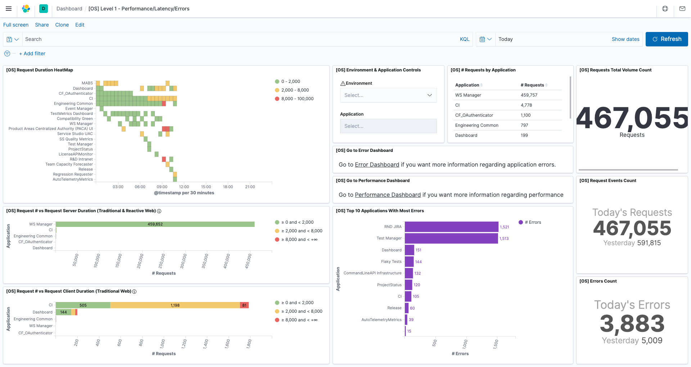
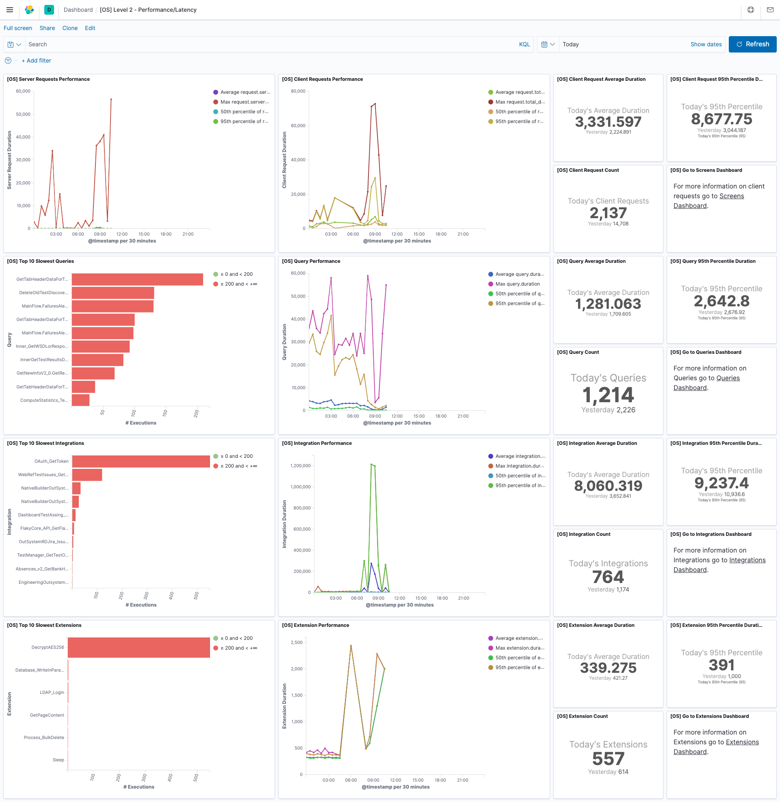
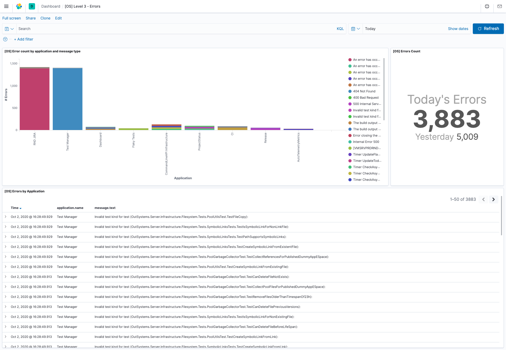
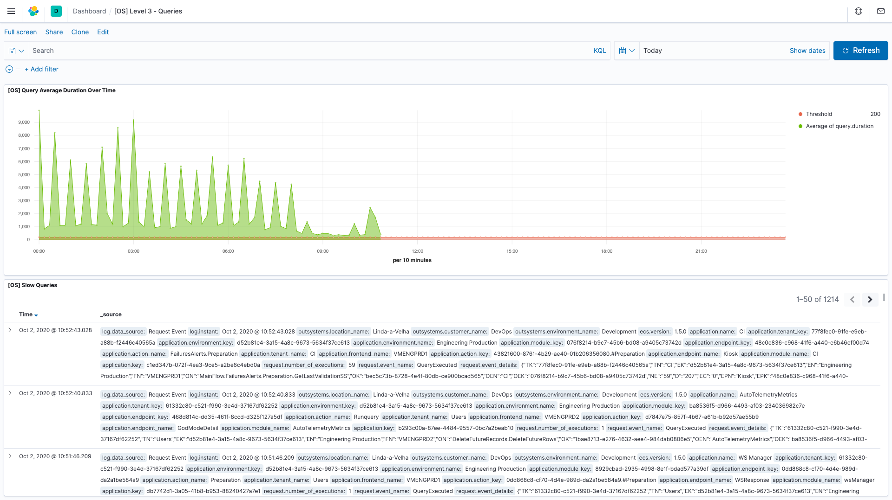
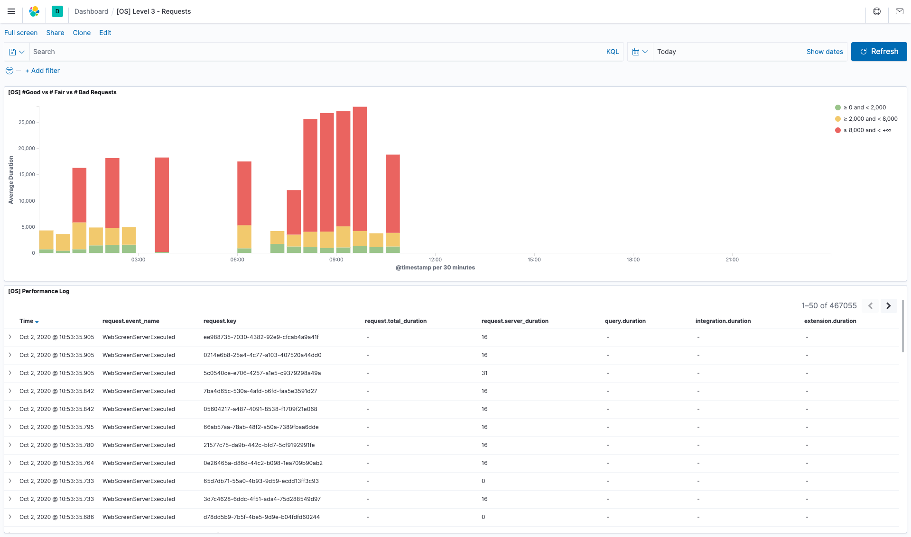
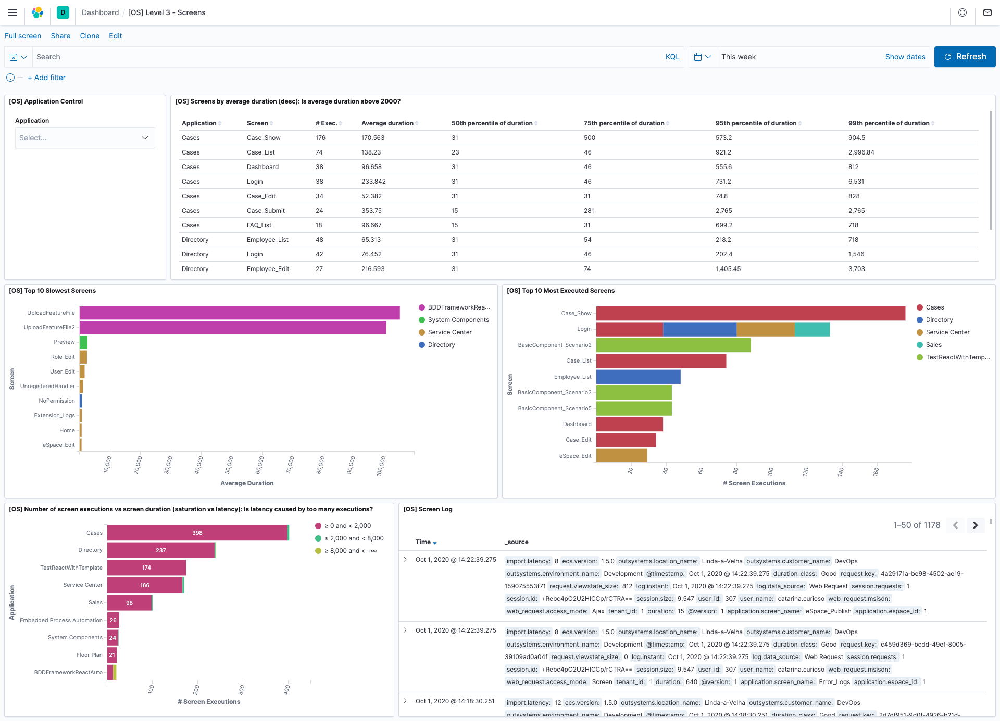
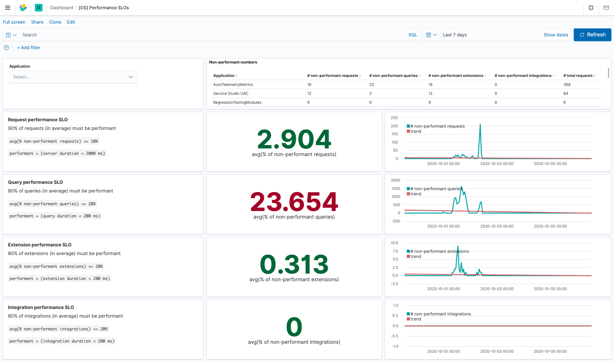

# outsystems-elastic-integration 🚀

## About
This repository contains [Elastic](https://elastic.co/) accelerators to provide better and faster insights on top of [OutSystems](https://www.outsystems.com/) monitoring data.

These accelerators are:
- **Elasticsearch commands**
    - Help to set up indices and their lifecycle policies.
- **Logstash pipelines**
    - Simplify the ETL of monitoring data from the OutSystems platform.
    - Enrich data to allow building more human-readable visualizations.
- **Kibana dashboards**
    - Provide an out-of-the-box set of visualizations that help understand OutSystems applications and platform health, based on their performance and errors.
    - Reduce time to insights (based on OutSystems monitoring data).
    - Improve troubleshooting capabilities.

## Goal 🎯
The major goal of these accelerators is to provide OutSystems customers with an out-of-the-box solution to:
- Easily **observe the OutSystems monitoring data on Elastic with more advanced visualizations**, compared to the ones from the built-in tools of the OutSystems platform.
- Easily search through OutSystems monitoring data, in particular through the OutSystems logs with:
    - Free text search.
    - Selection of visible information.
- **Do more advanced monitoring**, compared to what can be done using the built-in tools of the OutSystems platform. Things like:
    - Build alerts for an OutSystems environment or OutSystems Factory.
    - Leverage Elastic analytic capabilities to have deeper insights on performance and behaviour of applications, and the platform itself.
- **Observe OutSystems applications performance and errors through time**.
    - Quickly pinpoint performance bottlenecks, areas to improve, etc.
    - Figure out what is affecting performance:
        - Slow Queries
        - Slow Integrations
        - Slow Extensions
- Provide an example of how to **set up and monitor SLOs**.

## Outcomes

Here are some examples of OutSystems metrics that can be monitored using these accelerators:
- **Request Time Duration** (for each request):
    - Client Time (load time)
    - Server Time, which can be decomposed into:
        - SAT (Session Acquisition Time)
        - Query Execution Time
        - Integration Execution Time
        - Extension Execution Time
- **Server side performance metrics**
    - Session size
    - Viewstate size
    - Number of slow queries
    - Number of slow integrations
    - Number of slow extensions
- **Errors metrics**
    - Number of errors
    - Number of errors by type

> These metrics are the ones that **OutSystems Customer Success Experts** teams consider to be a starting point to understand applications and platform performance.

> As stated, these are just examples of some metrics that can be monitored, based on the platform data.

## Dashboards

#### Level 1 - Performance / Latency / Errors
A high level perspective of performance, latency and errors:

#### Level 2 - Performance / Latency
An overview of performance and latency for requests and the most important low-code objects (queries, integrations and extensions):

#### Level 3 - Errors
A deeper view of error patterns:

#### Level 3 - Queries
A deeper view of Query performance:

#### Level 3 - Requests
A breakdown of "Good" vs "Fair" vs "Bad" requests and of where is the time spent for each request:

#### Level 3 - Screens
A deeper view of Screen performance:

#### Performance SLOs
An example dashboard on how to build a bird's-eye view of SLOs track-and-trend, for requests and the most important low-code objects (queries, integrations and extensions):

## How to use the contents of this repository

If you have little to no experience with the Elastic stack, you can refer to:
- [How to set up the necessary Elastic stack](docs/Setup-ELK.md).

If you are good with setting up the Elastic stack, and you want to know how to use these accelerators, check the following documents (with the following order):
- [How to use the Elasticsearch accelerators](elasticsearch/README.md).
- [How to use the Logstash accelerators](logstash/README.md).
- [How to use the Kibana accelerators](kibana/README.md).

If you want to go a bit further and have a look at an example of how to set up a dashboard in Kibana to track performance SLOs, you can refer to:
- [How to set up the example "Performance SLOs" dashboard](docs/Performance-SLOs.md).

If you want to explore deeper what can be taken out of OutSystems monitoring data, you can refer to:
- [Understand OutSystems monitoring data](docs/Monitoring-Data.md).

## How to contribute 📝
**OutSystems Customer Success DevOps team** maintains this repository and is deeply interested in your contribution!
- Reach us through:
    - [OutSystems Community](https://www.outsystems.com/community/)
    - Open an [issue](https://github.com/OutSystems/outsystems-elastic-integration/issues)
- Make a contribution directly here on GitHub
    - Learn [how](https://kbroman.org/github_tutorial/pages/fork.html).

## License 📃
OutSystems makes the contents of this repository available under the Apache License with no support, and following the same logic specified on this [notice](https://github.com/OutSystems/outsystems-pipeline/blob/master/NOTICE.md).

## Change log
See the change log to learn about the latest changes and improvements to this repository.
